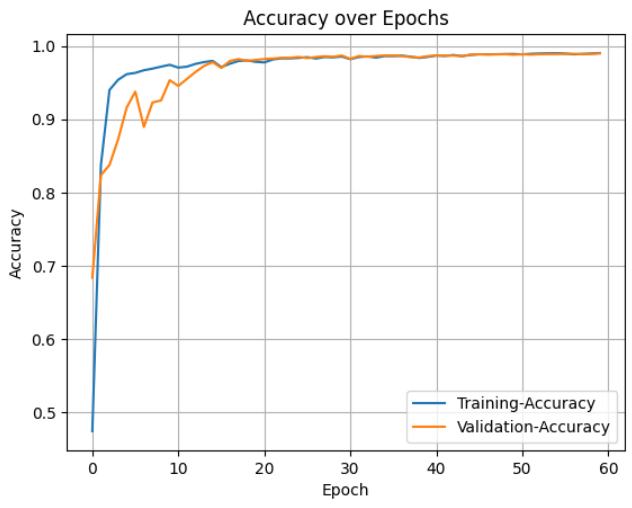
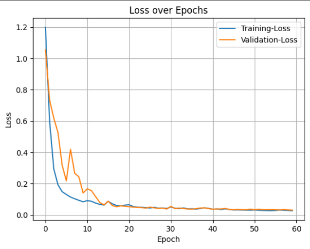
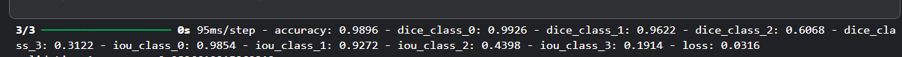
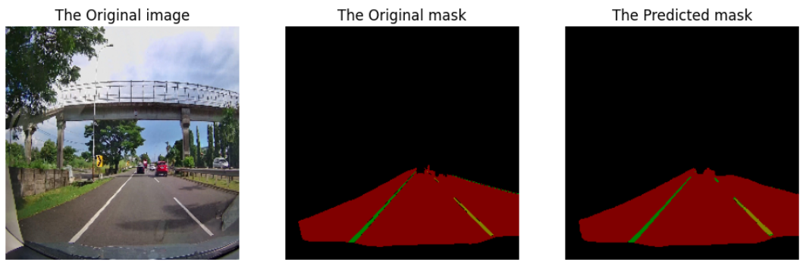

# Road_Lane_Segmentation

### Project Overview
This project focuses on road lane segmentation using deep learning techniques. It leverages a U-Net–based architecture to detect and segment lane regions from road images, with preprocessing and data augmentation to improve accuracy. The model outputs pixel-level predictions, enabling applications in autonomous driving and intelligent transportation systems.

### 📂 Dataset
I have used the [Road Lane Segmentation](https://www.kaggle.com/datasets/sovitrath/road-lane-segmentation-train-test-split/data) on Kaggle for this project.
The dataset consists of road images and corresponding lane segmentation masks.
Masks are encoded in RGB format, with each class (road, lane markings, background, etc.) represented by a unique color.
Preprocessing steps include resizing, normalization, and conversion of RGB masks into class indices.
Data augmentation (flipping, rotation, cropping, brightness adjustments) was applied to increase robustness.

### 🧠 Methodology

Model Architecture: A U-Net–based convolutional neural network designed for semantic segmentation.
Preprocessing: Images resized to a fixed input size.
Masks converted from RGB to one-hot encoded class labels.
Training:
Loss Function: Categorical Crossentropy (or Dice Loss for class imbalance).
Optimizer: Adam with learning rate scheduling.
Metrics: Accuracy, IoU (Intersection over Union) for each class, and Dice Score for each class.

### Performance Analysis
Plotting the accuracy and loss of the trained model is always the first step to anaylze how the the model is performing. Here are two pictures illustrating the performance and Loss.

**Accuracy Curve**  

**Loss Curve**  

📊 Results
The model achieved consistent segmentation performance across training and validation sets.
Visual evaluation shows clear identification of lane regions even in complex road scenarios.
Sample predictions demonstrate the ability of the model to generalize beyond the training dataset.

**Evaluation**  

**Prediction Plot**  

